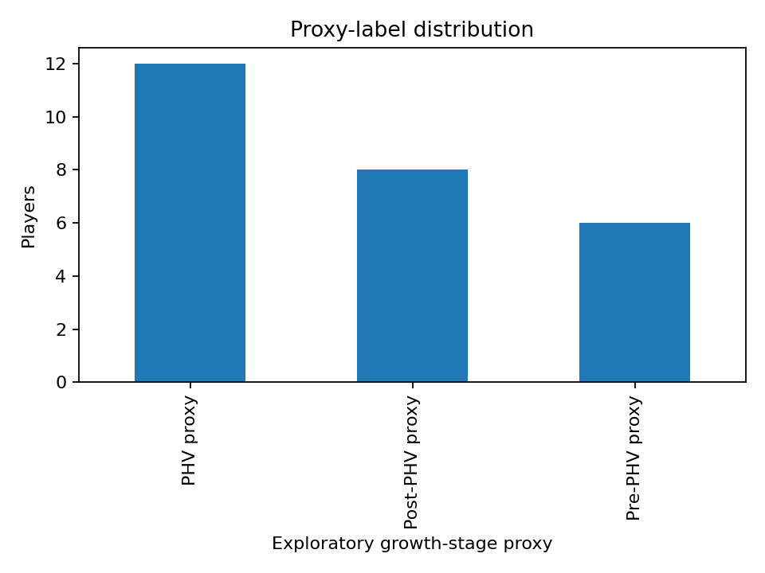
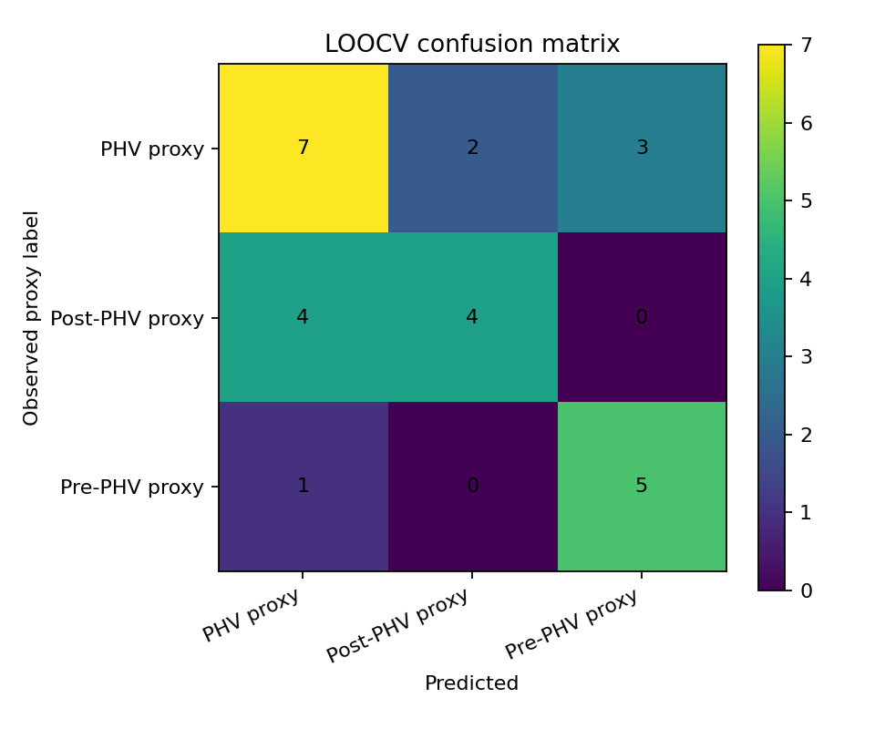
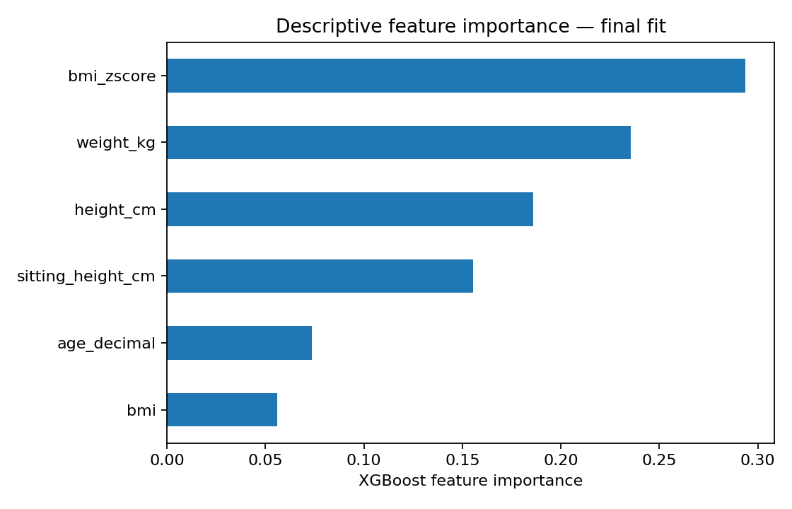

# Project 01 — Youth Football Growth & Maturation Analysis

Exploratory football-data project based on work developed during a youth-football internship.

## Problem

Players in the same age group can differ substantially in growth and physical development. This project explores how simple anthropometric data can be transformed into age-standardized indicators and analysed computationally.

## Technical workflow

`Player data → validation → decimal age → BMI → growth references → z-scores → exploratory proxy labels → XGBoost → LOOCV → visual outputs`

## Stack

- Python
- pandas
- NumPy
- scikit-learn
- XGBoost
- matplotlib
- openpyxl

## Validation strategy

The original internship sample contained 26 players. Leave-One-Out Cross-Validation (LOOCV) was used to avoid losing a large fraction of the sample to a conventional holdout set.

LOOCV improves data efficiency in evaluation, but it does not remove the uncertainty associated with a very small sample.

## Important limitation

The maturity categories in this project are an **exploratory proxy** derived from the height-z-score rule used in the internship project. They are not a clinically validated maturity assessment.

`height_zscore` is not used as an XGBoost predictor because it directly defines the target proxy. The machine-learning section therefore evaluates whether the remaining anthropometric variables can reproduce those derived labels. It should not be interpreted as validation of biological maturity status.

## Reproducible public demo

The repository is executable without private club data or external reference workbooks. The default run uses:

- `data/synthetic_players.csv` — 26 fictitious players;
- `data/reference/synthetic_hfa_boys_reference.csv` — synthetic height-for-age demonstration values;
- `data/reference/synthetic_bmi_boys_reference.csv` — synthetic LMS demonstration values.

These reference files are **not official clinical or WHO reference data**. They exist only so the public portfolio can be run end-to-end without redistributing third-party data.

## Privacy

No identifiable youth-player data are published. Names, birth dates and anthropometric measurements in the public demo are synthetic.

## Run

```bash
pip install -r requirements.txt
python python/maturation_analysis.py
```

The script generates:

- `outputs/maturation/processed_players.csv`
- `outputs/maturation/loocv_classification_report.json`
- `outputs/maturation/loocv_confusion_matrix.png`
- `outputs/maturation/feature_importance.png`
- `outputs/maturation/proxy_distribution.png`

To use another compatible dataset or reference source, override the CLI arguments documented with:

```bash
python python/maturation_analysis.py --help
```

## Example outputs

### Proxy-label distribution



### LOOCV confusion matrix



### Feature importance



## Project context

This repository is a portfolio reconstruction of an exploratory internship analysis. The public version prioritizes reproducibility, privacy, methodological transparency and clear separation between an analytical demonstration and a validated maturity-assessment tool.
